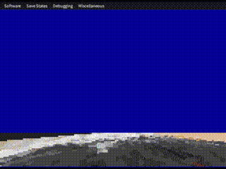

# MD-Mode-7
A Mode 7 styled floor renderer for the SEGA Mega Drive.

---

## Introduction
The [SNES' "Mode 7"](https://sneslab.net/wiki/Mode_7) is a display mode that allows affine transformations (skewing, rotation, scaling) to be applied to a tilemapped plane. The competition, SEGA's Mega Drive had much more basic hardware and had no such similar graphics mode. What the Mega Drive did have over the SNES, was processing power, a CPU that runs at double the clock speed. While this doesn't give us enough time to apply actual affine transformations (That would require over 200,000 multiply instructions in a single frame, yikes!), we do have enough time to pull off the effect if we're smart with optimisations. Optimisation first starts at planning. Our goal is the achieve specifically the 3D floor effect seen in many games like F-Zero, Super Mario Kart, which means for the most part we're working with a fixed view that only moves and rotates around the camera's yaw. With this, the basic principle of our approach is to make a pre-calculated projection view of the map for each possible rotation, and then apply the camera position in code afterwards, to get a final pointer into the map data to source the pixel from, and then drawing it into the bitmap. This achieves a believable although somewhat choppy effect since there's no way to partially scroll into a pixel.

## Map Format
Maps are 128x128 double sized pixels. Each pixel is 2 VDP pixels, so dithering can be encoded. This increases the colour count from a pitiful 16 to 256.
Maps can be generated with MapGen.py, a Python script that will take a 16 colour indexed 256x256 image named Map.png, and will convert it into 128x128 4BPP map data.

## Projection Table Format
The projection table is a massive set of 64 tables, that are 128x24 pixels. Each table corresponds to an angle. And represents the projected view of the screen converted into tile format for the Mega Drive. Each entry is 2 signed bytes of the X and Y offset into the map data.

## Setup
The code provided is **only a renderer**. There are a few steps required on your part to get mode 7 up and running in your project.
- Initialize a tilemap of unique tiles running top to bottom, left to right, on both planes A and B.
- Set plane A vertical scroll to 0 and plane B vertical scroll to 1. This will make plane B fill the gaps between plane A.
- Load 128x128 map data into mode7_map.
- Load mode7_camera_game into a0 and call Mode7_Draw1stHalf and Mode7_Draw2ndHalf directly to initialize the first frame.
- Call Mode7_DrawFloor during your main game loop.
- During V-blank, check if the mode7_render_step is on MODE7_RENDER_DMA, and then DMA mode7_bitmap into your chosen location in VRAM, and finally reset mode7_render_step to MODE7_RENDER_1ST.

## Optional

### Freeing some nametable VRAM
Instead of copying the tilemap data to both nametables to make double tall pixels, you can instead wait for an H-blank on the scanline the floor starts drawing, and then mirror plane A's nametable address to plane B. This frees up plane B's nametable VRAM in the space the floor *would* be for whatever else you may need. If you also set the vertical scroll on this scanline then you can have vertical scrolling effects on the screen above the floor's scanline.

### Darkening Horizon
Utilizing shadow/highlight and H-blank colour transfers we can make the view in the distance "fade". Here are the steps to do so;
- Enable shadow/highlight during initialisation. This can optionally be done on the scanline the floor is drawn, but if you also use shadow/highlight sprites they won't render as intended above the floor.
- Reserve space for 1 palette line in RAM.
- Load the main floor palette into this line.
- Load a darker floor palette into your main palette buffer.
- Make all rows on the bitmap tilemap high priority except for the first and third rows.
- On the first scanline of the third row (the low priority one) of tiles on the floor, transfer the main floor palette to CRAM.
- Ensure all sprites rendered on the floor are high priority so they don't hide under the floor.
This should give you 4 different shades of the palette getting darker in the distance.

## Special Thanks
Inspiration - gasega68k
Advice - MarkeyJester